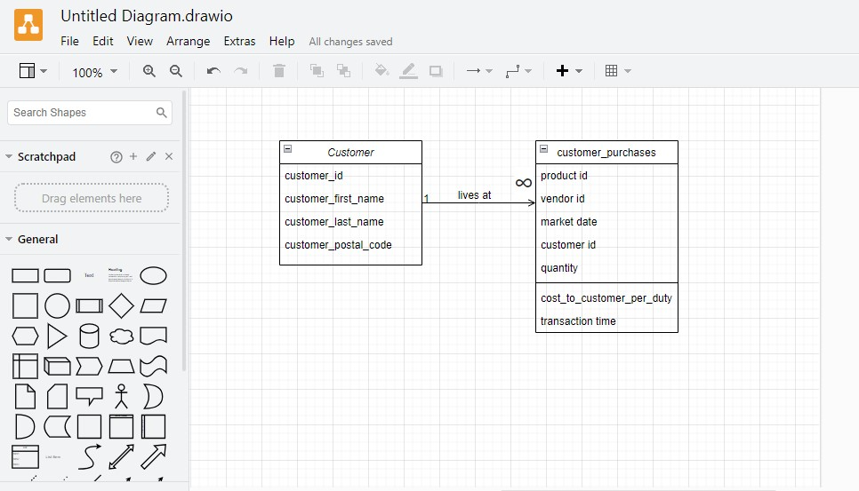

# Homework 2: Basic SQL 

-  	Due on Friday, September 13 at 11:59pm
-  	Weight: 8% of total grade
-  	Upload one .sql file with your queries

# SELECT
1. Write a query that returns everything in the customer table.
2. Write a query that displays all of the columns and 10 rows from the customer table, sorted by customer_last_name, then customer_first_ name.

# WHERE
1. Write a query that returns all customer purchases of product IDs 4 and 9.
2. Write a query that returns all customer purchases and a new calculated column 'price' (quantity * cost_to_customer_per_qty), filtered by vendor IDs between 8 and 10 (inclusive) using either:
	1.  two conditions using AND
	2.  one condition using BETWEEN

# CASE
1. Products can be sold by the individual unit or by bulk measures like lbs. or oz. Using the product table, write a query that outputs the `product_id` and `product_name` columns and add a column called `prod_qty_type_condensed` that displays the word “unit” if the `product_qty_type` is “unit,” and otherwise displays the word “bulk.”

2. We want to flag all of the different types of pepper products that are sold at the market. Add a column to the previous query called `pepper_flag` that outputs a 1 if the product_name contains the word “pepper” (regardless of capitalization), and otherwise outputs 0.

# JOIN
1. Write a query that `INNER JOIN`s the `vendor` table to the `vendor_booth_assignments` table on the `vendor_id` field they both have in common, and sorts the result by `vendor_name`, then `market_date`.

- ( [text](../../../Desktop/dsi/SQL/homework-2.sql)   )

